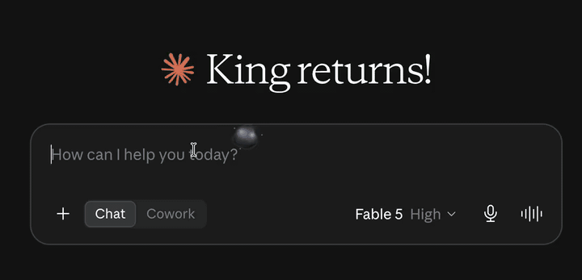
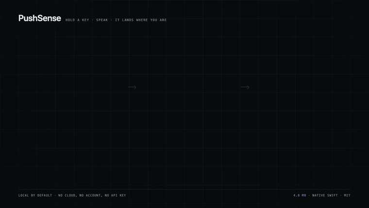

# PushSense（感应）

macOS 上的按键说话（push-to-talk）听写工具。按住一个键，说话，松开——文字直接
打进你当前光标所在的输入框。**中英文可以在同一句话里混着说**，不用切换语言，
不用改设置。

完全本地运行。不联网、不需要账号、不需要 API key。



<sub>三段真实录屏，一镜到底。在 Claude 里说：「Hey Claude, help me write an email to my
friend who is coming in two weeks from China. 我朋友过两天会从中国过来，告诉他我会在家里
等他。」——一句话，两种语言，不需要切换。然后是 Google 搜索框，然后是 TextEdit。
没有一帧是演示动画。</sub>


[English](README.md)



<sub>第一次要设置的、今天已经能用的、管道已经接通的，以及还只停留在计划里的。
最后一块用虚线是有原因的：这个仓库里目前还没有任何 MCP 代码。</sub>

## 为什么做这个

我打字很多，而且经常中英文夹杂着想问题——"这个 feature 的 latency 有点高"对我
来说是一句很正常的话。市面上试过的听写工具要么只认一种语言、混着说就出错，
要么把语音传到服务器。每天要口述这么多内容，交给第三方我不放心。

所以：本地运行，而且句子中间切语言也不会崩。

原生 Swift 开发，**装完 4.8MB，打包成 dmg 只有 2.2MB**——没有 Electron，
没有 Chromium。

## 工作原理

```
按住 Right-Option  →  录音（AVFoundation）
                  →  转写（whisper.cpp，Metal GPU）
                  →  打字输出（CGEvent unicode）
```

四个小文件，一步一个：`Hotkey.swift`、`Recorder.swift`、`Whisper.swift`、
`Injector.swift`。常驻在菜单栏，录音时显示一个跟随光标的光晕。

## 功能

- **一句话里中英文自由切换** —— Whisper 原生支持中英混说的转写；输出统一
  强制转成简体（通过系统的 `CFStringTransform`），繁简不会混着出现，同时
  英文和 emoji 完全不受影响
- 任意快捷键、任意麦克风、Whisper 支持的任意语言
- 语音模型首次运行时由 app 自己下载，不会打包进安装包里
- 静音会被直接丢弃而不是打出来 —— Whisper 面对近乎无声的音频时不会返回
  空结果，而是"自信地编"，比什么都不打更糟
- 可选的"Smart mode"：本地 Ollama 模型对原始转写结果做二次整理（默认关闭，
  原始输出是默认行为）。也支持云端 LLM，自己填 API key
- 设置项存在系统 Keychain 里

## 安装

**目前没有已签名的下载包。** 我本地打的 `.app` 是 ad-hoc 签名，在除了我自己
电脑之外的任何机器上 macOS 都会报"已损坏"——比完全不签名还麻烦，因为 Gatekeeper
连右键"打开"这条路都不让走。要做公证（notarization）需要付费的 Apple
开发者账号，我还没买。

所以：自己编译。

```bash
git clone https://github.com/billyxu008/pushsense.git
cd pushsense/core
bash make-app.sh
```

需要**完整版 Xcode**——只装 Command Line Tools 打不出 `.app`。编译产物是
`core/PushSense.app`，拖进 `/Applications` 即可。

首次启动 macOS 会请求**麦克风**和**辅助功能（Accessibility）**权限。辅助功能
是让它能把文字打进其他 app 的必要权限，没有这个权限转写出来的文字没地方去。

## 踩过的坑

写在这里，希望对同样在做类似东西的人有用：

- **ggml 需要在 `whisper_init` 之前调用 `ggml_backend_load_all()`。** 漏了这
  一步会报 `backends = 0` 然后直接退出，完全看不出是少调了一个函数。
- **打包比依赖更可靠。** 这个 app 以前运行时依赖 Homebrew 装的库——在我自己
  机器上没问题，换台机器直接崩。现在所有依赖都被复制进了 app bundle 里。
- **Whisper 会对着静音编内容。** 它不会返回空字符串，而是返回一段听起来很
  合理的假文本，必须专门过滤掉。
- **Ad-hoc 签名比完全不签名更糟**——只要这个 app 要交给别人用。

## License

[MIT](LICENSE)

---

更多说明、教程和演示：**[billyxu-dev.vercel.app/pushsense.zh.html](https://billyxu-dev.vercel.app/pushsense.zh.html)**
